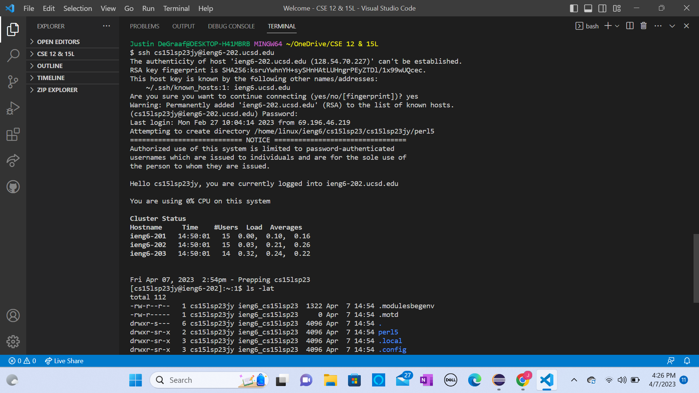
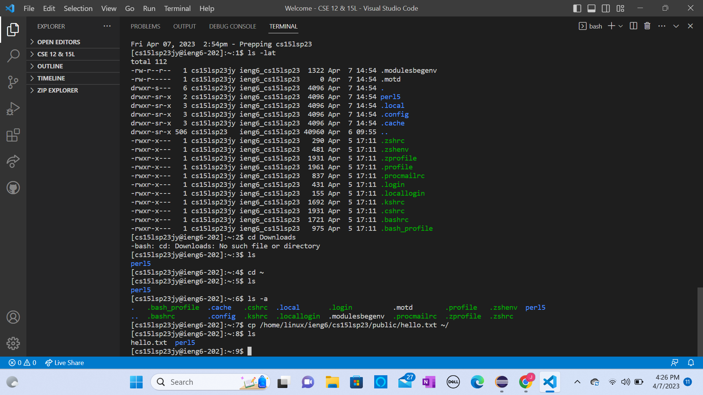
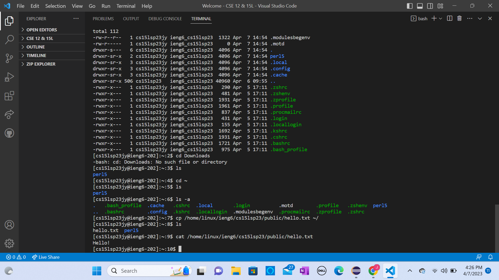

## Lab Report 1
.png)

So I did not have to install VS code. As you can see from the image above I have already done a project with it, the one shown was for my last class, LTCS 180. VS code is great, I like it a lot better than eclipse, cough cough CSE 12. It allows for simple navigation and project building.

If you need to install VScode, go to this link: https://code.visualstudio.com/. Follow the steps to install the right version based on the computer you have. Say depending if you have a Mac or a Windows computer... etc.  Once you have it installed you'll be ready to start coding projects in VScode!

The image above demonstrates me remotley connecting. During lab I wasn't able to login, but I was able to solve my problem by looking at our class discussion board where someone showed that you just had to add "-202" to the end of ieng6. I have no idea why this made it work. Then all I had to do was just answer yes, and enter my password of my newly setup cs15l account, and bam, I am remotely connected.

If you possibly need some help, here is a link where you can find your CSE15L specific account: https://sdacs.ucsd.edu/~icc/index.php.

The two Images above are of me trying out some commands. I was able to open the file hello.txt, where it said hello to me! Navigating around and using certain commands is pretty easy and self explanitory, I found it simple. One thing that I did not demonstrate is loging out, allit would take is typing "exit" into the command line, which is the are right to the right of the $ with a cursor.

"cd" - will change to a directory you want to go to
"pwd" - will print your working directory, like where you are currently at
"ls" - will list possible files and other dircetorys that are in your current working directory
"cp" - will copy a file and allows you to move it somewhere else
"mkdir"- will make a new directory
